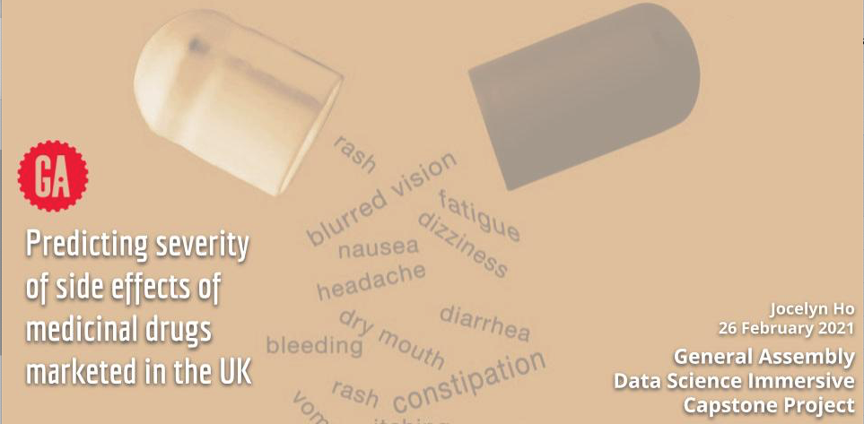

# Predicting the severity of side effects of medicinal drugs marketed in the UK

### Overview
This capstone project was completed as part of the General Assembly Data Science Immersive course in London (completed remotely due to COVID lockdown restrictions).

I completed this end-to-end project within 6 weeks, from creating a problem statement, collecting data and creating a database from scratch, to presenting my findings to a non-technical audience.


### Files in this repository
- [Technical report](https://github.com/jocelynho/ga_capstone/tree/master/technical_report):
    - This includes introduction, objectives, methodology, information on the dataset, EDA, findings, conclusion, and future work.
- Folders containing Jupyter notebooks `(.ipynb)`:
    1) Data Collection (3 notebooks, 1 for each data source):
        - a) [Yellow Card Scheme](https://nbviewer.jupyter.org/github/jocelynho/ga_capstone/blob/master/1_data_collection/1a_yellow_card.ipynb)
        - b) [DrugBank](https://nbviewer.jupyter.org/github/jocelynho/ga_capstone/blob/master/1_data_collection/1b_drugbank.ipynb)
        - c) [Drugs.com reviews](https://nbviewer.jupyter.org/github/jocelynho/ga_capstone/blob/master/1_data_collection/1c_reviews.ipynb)
    2) Creating Dataset (2 notebooks):
        - a) [SQL on Yellow Card data](https://nbviewer.jupyter.org/github/jocelynho/ga_capstone/blob/master/2_create_dataset/2a_sql_yellow_card.ipynb)
        - b) [Merging all data sources together](https://nbviewer.jupyter.org/github/jocelynho/ga_capstone/blob/master/2_create_dataset/2b_create_dataset.ipynb)
    3) [Exploratory Data Analysis (EDA)](https://nbviewer.jupyter.org/github/jocelynho/ga_capstone/blob/master/3_eda/3_eda.ipynb)
    4) [Data Modelling](https://nbviewer.jupyter.org/github/jocelynho/ga_capstone/blob/master/5_models/5_models.ipynb)
    5) Extra Natural Language Processing (NLP) trials:
        - b) [Extra NLP on reviews](https://nbviewer.jupyter.org/github/jocelynho/ga_capstone/blob/master/3_eda/capstone_7_nlp_reviews.ipynb)
        - c) [Extra NLP on DrugBank data](https://nbviewer.jupyter.org/github/jocelynho/ga_capstone/blob/master/3_eda/capstone_8_nlp_drugbank.ipynb)
        
- [Presentation slides](https://github.com/jocelynho/ga_capstone/blob/57f6d026c7c1f9d1b717007e2170079e1a1de7d3/slides/Jocelyn_Ho_Capstone_Presentation.pdf):
    - Slides were aimed at a non-technical audience, and were used for the final capstone presentation during the course.

> Note: If the notebooks do not load, please use the [nbviewer](https://nbviewer.jupyter.org/) by copying and pasting the urls.

### Prerequisites for this project
Key libraries used in this project include:
- For web scraping:
```python
requests
BeautifulSoup
Selenium
ChromeDriver/ WebDriver
tqdm
```
- For creating the database:
```python
sql from pandas.io
```
- For plotting graphs:
```python
seaborn
matplotlib
```
- Other general libraries:
```python
sklearn
pandas
numpy
```


### License
For full details of the respective licences, please visit the following pages:
- [Yellow Card Scheme](https://yellowcard.mhra.gov.uk/iDAP/)
- [UCI Drugs.com reviews Data Set](https://archive.ics.uci.edu/ml/datasets/Drug+Review+Dataset+%28Drugs.com%29)
- [DrugBank Online](https://go.drugbank.com/)


### Citations
> Wishart DS, Feunang YD, Guo AC, Lo EJ, Marcu A, Grant JR, Sajed T, Johnson D, Li C, Sayeeda Z, Assempour N, Iynkkaran I, Liu Y, Maciejewski A, Gale N, Wilson A, Chin L, Cummings R, Le D, Pon A, Knox C, Wilson M. DrugBank 5.0: a major update to the DrugBank database for 2018. Nucleic Acids Res. 2017 Nov 8. doi: 10.1093/nar/gkx1037.
> Felix Gräßer, Surya Kallumadi, Hagen Malberg, and Sebastian Zaunseder. 2018. Aspect-Based Sentiment Analysis of Drug Reviews Applying Cross-Domain and Cross-Data Learning. In Proceedings of the 2018 International Conference on Digital Health (DH '18). ACM, New York, NY, USA, 121-125. DOI: [Web Link](https://dl.acm.org/doi/10.1145/3194658.3194677)
